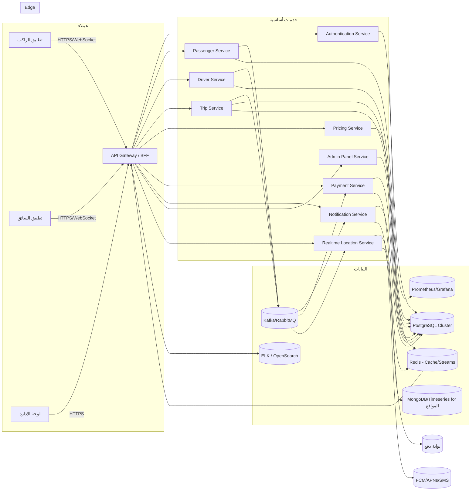
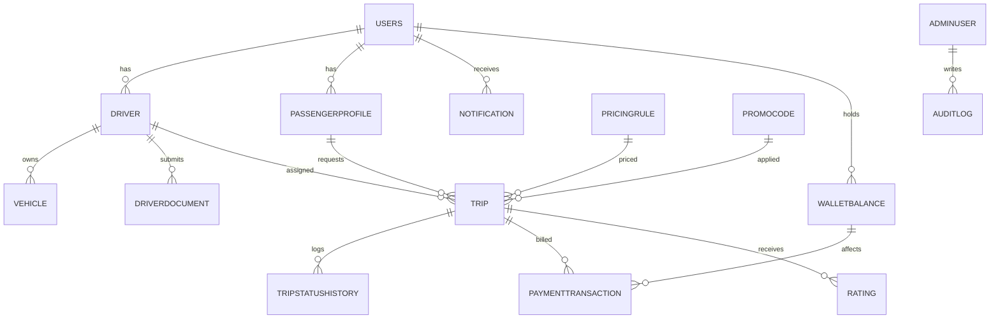

# تصميم نظام متكامل لتطبيق التكسي (راكب/سائق/لوحة إدارة)

## 1) System Architecture
### 1.1 مخطط بنية النظام (مبسط)

### 1.2 شرح المكونات
- **API Gateway/BFF:** توحيد الدخول، مصادقة JWT، توجيه حسب النسخة، rate limiting، ترجمة WebSocket، Aggregation للردود للـ apps.
- **Authentication Service:** إصدار JWT + Refresh، إدارة الجلسات، OAuth2 إذا لزم، ربط SMS OTP.
- **Passenger Service:** CRUD للملف، المفضلات، المحفظة، الرحلات السابقة.
- **Driver Service:** تسجيل السائق، المستندات، حالة الاتصال، جدول العمل، صلاحيات المركبات.
- **Trip Service:** إنشاء/تخصيص/إدارة حالات الرحلات، توزيع السائقين، حساب ETA، إدارة حالة الرحلة.
- **Pricing Service:** تطبيق قواعد التسعير الديناميكي (وقت/مسافة/ذروة)، استعلام عن PricingRules، إصدار fare estimate.
- **Payment Service:** تكامل بوابات الدفع، Ledger داخلي، محفظة، تسويات، التعامل مع الدفع النقدي/الإلكتروني.
- **Notification Service:** Push/SMS/Email، قوالب متعددة لغات، تتبع التسليم.
- **Admin Panel Service:** واجهات RBAC لإدارة المستخدمين، السائقين، التسعير، التقارير، مراجعة المستندات.
- **Realtime Location Service:** WebSocket/MQTT، قنوات لكل رحلة، تخزين مؤقت للموقع في Redis، أرشفة نقاط المسار في MongoDB/TimeSeries.
- **Logging/Monitoring:** ELK/OpenSearch للـ logs، Prometheus/Grafana للـ metrics/alerts.

### 1.3 نمط المعمارية المقترح
- **Modular Monolith مع قابلية التفكيك إلى Microservices لاحقاً.** فصل الدومينات في وحدات مع واجهات داخلية واضحة، ونشرها كخدمات مستقلة عند الحاجة (Trip/Payment/Location أول المرشحين).

### 1.4 الربط مع الخرائط
- استخدام **Mapbox أو Google Maps** لـ geocoding والخرائط واتجاهات القيادة.
- استهلاك Directions API وDistance Matrix لاحتساب ETA/التسعير.
- تخزين Tile cache محلياً للمدن الكبرى، مع fallback للـ provider، وتحكم حصص عبر API Gateway.

### 1.5 تتبع الزمن الحقيقي
- **WebSockets (أو MQTT عبر WebSocket)** من التطبيقين إلى Realtime Location Service.
- نشر **Pub/Sub** داخلي (Kafka/Redis Streams) لبث موقع السائق وتحديثات الرحلة لكل المشتركين (راكب، سائق، لوحة الإدارة، رابط المشاركة).
- fallback لسيرفر **Firebase RTDB** أو **Pusher** إذا كان زمن التسليم يحتاج حل مُدار.

### 1.6 Load Balancing & Scaling
- **L7 Load Balancer** (AWS ALB/GCP HTTPS LB) أمام API Gateway.
- **Auto Scaling** حسب CPU/RPS، مع HPA على Kubernetes للخدمات الحساسة (Trip/Location/Payment).
- استخدم **read replicas** لـ PostgreSQL، وRedis Cluster، وPartitioning لجداول Trip/Location.

### 1.7 Logging/Monitoring
- **Logs:** Fluent Bit → ELK/OpenSearch مع حقول `trace_id`, `trip_id`, `driver_id`.
- **Metrics:** Prometheus + Grafana (Dashboards للـ RPS، latency، أخطاء الدفع، زمن التخصيص).
- **Tracing:** OpenTelemetry + Jaeger.

## 2) Database Schema (ERD)

### جداول أساسية (PostgreSQL)
- **Users** (`id` PK, `phone` unique index, `email` unique nullable, `role` enum: passenger/driver/admin, `status`, `created_at`).
- **Drivers** (`id` PK/FK → Users, `national_id`, `license_number`, `verified_at`, `online_status` indexed, `rating_avg`, `city`).
- **Vehicles** (`id` PK, `driver_id` FK indexed, `plate_number` unique, `make`, `model`, `year`, `color`, `capacity`, `type` enum sedan/suv/bike).
- **DriverDocuments** (`id` PK, `driver_id` FK indexed, `type` enum license/id/insurance, `url`, `expires_at`, `status` enum pending/approved/rejected, indices على (`driver_id`, `status`)).
- **PassengerProfiles** (`id` PK/FK → Users, `name`, `language`, `default_payment_method`, `home_lat`, `home_lng`, `work_lat`, `work_lng`).
- **Trips** (`id` PK UUID, `passenger_id` FK, `driver_id` FK nullable, `vehicle_id` FK nullable, `pickup_lat/lng`, `dropoff_lat/lng`, `pickup_address`, `dropoff_address`, `status` enum requested/driver_assigned/arriving/ongoing/completed/cancelled/no_driver, `estimated_fare`, `final_fare`, `promo_code_id` FK nullable, `pricing_rule_id` FK, `distance_m`, `eta_seconds`, `started_at`, `ended_at`, `canceled_by` enum passenger/driver/system, indices على (status), (passenger_id, created_at), (driver_id, status)).
- **TripStatusHistory** (`id` PK, `trip_id` FK indexed, `status`, `note`, `created_at`, index على (`trip_id`, `created_at`)).
- **PricingRules** (`id` PK, `city`, `vehicle_type`, `base_fare`, `per_km`, `per_min`, `surge_multiplier`, `time_window`, index (`city`, `vehicle_type`)).
- **PaymentTransactions** (`id` PK, `trip_id` FK, `user_id` FK, `wallet_id` FK nullable, `amount`, `currency`, `method` enum cash/card/wallet/mobile_money, `provider` enum stripe/tap/zaincash/asiacell, `status` enum pending/success/failed/refunded, `provider_ref`, `captured_at`, indices (`trip_id`), (`user_id`, `status`)).
- **WalletBalance** (`id` PK, `user_id` FK unique, `balance`, `currency`, `updated_at`).
- **Ratings** (`id` PK, `trip_id` FK unique, `passenger_rating`, `driver_rating`, `comment`, `created_at`, index (`driver_rating`)).
- **Notifications** (`id` PK, `user_id` FK, `type`, `title`, `body`, `metadata` JSONB, `channel` push/sms/email, `status` sent/failed, `created_at`, index (`user_id`, `created_at`)).
- **PromoCodes** (`id` PK, `code` unique index, `discount_type` percent/fixed, `value`, `max_uses`, `used_count`, `starts_at`, `ends_at`, `city`, `vehicle_type`, index (`city`, `starts_at`, `ends_at`)).
- **AdminUsers** (`id` PK/FK → Users، `role` enum super_admin/ops/support/finance، `permissions` JSONB).
- **AuditLogs** (`id` PK، `admin_id` FK، `action`, `entity_type`, `entity_id`, `payload` JSONB، `created_at`, index (`entity_type`, `entity_id`)).

### طبقة المواقع اللحظية
- **Redis (Geo/Streams):** مفتاح `driver:{id}:loc` يحوي (`lat`, `lng`, `heading`, `speed`, `ts`). Stream `trip:{id}:track` لآخر المواقع مع TTL قصير.
- **MongoDB/TimeSeries:** مجموعة `driver_locations` لآرشفة النقاط التاريخية (حقول `driver_id`, `trip_id`, `loc`, `ts`). فهارس مركبة على (`driver_id`, `ts`) و(`trip_id`, `ts`).

## 3) API Design (REST)
### 3.1 Passenger App
| Action | Method & URL | Request (مثال) | Response (مثال) | Validation | Auth |
|---|---|---|---|---|---|
| طلب OTP | `POST /v1/auth/request-otp` | `{ "phone": "+9647...", "channel": "sms" }` | `{ "request_id": "...", "expires_in": 120 }` | phone required، rate limit | لا |
| تحقق OTP | `POST /v1/auth/verify-otp` | `{ "phone": "+9647...", "code": "123456", "request_id": "..." }` | `{ "access_token": "jwt", "refresh_token": "..." }` | code length=6 | لا |
| تحديث ملف | `PATCH /v1/passenger/profile` | `{ "name": "Ali", "language": "ar" }` | `{ "id":1,"name":"Ali",... }` | name<=80 | JWT |
| إنشاء رحلة | `POST /v1/trips` | `{ "pickup": {"lat":33.3,"lng":44.4}, "dropoff": {"lat":33.35,"lng":44.45}, "vehicle_type":"sedan", "payment_method":"cash" }` | `{ "id":"uuid", "status":"requested", "estimate":{...} }` | required pickup/dropoff | JWT |
| حساب سعر ديناميكي | `POST /v1/pricing/estimate` | `{ "origin": {...}, "destination": {...}, "vehicle_type":"sedan" }` | `{ "base":2500, "total":3500, "surge":1.2, "currency":"IQD" }` | vehicle_type in enum | JWT |
| تتبع السائق | `GET /v1/trips/{id}/track` | - | `{ "driver": {"lat":..., "lng":..., "heading":...}, "eta_sec":180 }` | trip belongs to passenger | JWT |
| إلغاء الرحلة | `POST /v1/trips/{id}/cancel` | `{ "reason":"waited too long" }` | `{ "status":"cancelled" }` | status in cancellable | JWT |
| سجل الرحلات | `GET /v1/trips?limit=20&cursor=...` | - | `{ "items":[...], "next_cursor":null }` | limit<=50 | JWT |
| الدفع والمحفظة | `POST /v1/payments/charge` | `{ "trip_id":"uuid", "method":"wallet" }` | `{ "transaction_id":123, "status":"pending" }` | trip completed, balance check | JWT |

### 3.2 Driver App
| Action | Method & URL | Request | Response | Validation | Auth |
|---|---|---|---|---|---|
| تسجيل سائق | `POST /v1/driver/signup` | `{ "phone":"+9647...", "name":"Hussein" }` | `{ "driver_id":1, "status":"pending_docs" }` | phone required | لا |
| رفع مستند | `POST /v1/driver/documents` | `{ "type":"license", "file_url":"https://..." }` | `{ "id":10, "status":"pending" }` | type in enum | JWT |
| تفعيل الحساب | `POST /v1/driver/verify` | `{ "code":"123456" }` | `{ "status":"verified" }` | code len=6 | JWT |
| تغيير الحالة | `POST /v1/driver/status` | `{ "status":"online" }` | `{ "online_status":"online" }` | status in online/offline/busy | JWT |
| قبول/رفض رحلة | `POST /v1/trips/{id}/decision` | `{ "decision":"accept" }` | `{ "status":"driver_assigned" }` | trip assigned to driver, status requested | JWT |
| بدء/وصول/إنهاء | `POST /v1/trips/{id}/event` | `{ "event":"arrived" }` | `{ "status":"arriving" }` | event in [start,arrived,begin,complete,cancel] | JWT |
| بث الموقع | `POST /v1/driver/location` | `{ "lat":..., "lng":..., "speed":10 }` | `{ "ok":true }` | lat/lng required | JWT |
| أرباح السائق | `GET /v1/driver/earnings?from=..&to=..` | - | `{ "total":120000, "currency":"IQD", "trips":23 }` | date range max 31d | JWT |

### 3.3 Admin Panel
| Action | Method & URL | Request | Response | Auth |
|---|---|---|---|---|
| إدارة المستخدمين | `GET /v1/admin/users?role=driver` | - | `{ "items":[...], "next_cursor":... }` | RBAC: admin |
| الموافقة على المستندات | `POST /v1/admin/documents/{id}/review` | `{ "decision":"approve", "note":"ok" }` | `{ "status":"approved" }` | RBAC: ops |
| التحكم بالتسعير | `POST /v1/admin/pricing-rules` | `{ "city":"baghdad", "vehicle_type":"sedan", "base_fare":2500 }` | rule json | RBAC: pricing |
| إدارة الرحلات | `GET /v1/admin/trips?status=ongoing` | - | `{ "items":[...]} ` | RBAC: ops |
| إدارة العروض | `POST /v1/admin/promocodes` | `{ "code":"FIRST10", "discount_type":"percent", "value":10 }` | promo json | RBAC: marketing |
| التقارير | `GET /v1/admin/reports/revenue?from=..&to=..` | - | `{ "total":..., "currency":"IQD" }` | RBAC: finance |
| مراقبة النظام | `GET /v1/admin/metrics` | - | `{ "rps":..., "errors":... }` | RBAC: admin |
| عرض السجلات | `GET /v1/admin/audit?entity=trip&id=...` | - | `{ "items":[...]} ` | RBAC: admin |

### معايير عامة للـ API
- **Validation:** مكتبات Joi/Zod/DTO مع طول الحقول والأرقام الموجبة وإحداثيات صحيحة.
- **Errors:** هيكل موحّد `{ "error": { "code": "TRIP_NOT_FOUND", "message": "..." } }` مع أكواد مثل `AUTH_INVALID_OTP`, `TRIP_ALREADY_ASSIGNED`, `PAYMENT_FAILED`, `RATE_LIMITED`.
- **Auth:** JWT قصير العمر (15–30 دقيقة) في Authorization header، Refresh عبر `/auth/refresh`. RBAC لكل دور.

## 4) Security & Authorization
- **JWT + Refresh:** JWT قصير + Refresh طويل مخزن في httpOnly cookie أو Secure Storage، دوران مفاتيح التوقيع (kid + JWKS). تخزين جلسات مبدئية في Redis لتفعيل revocation.
- **RBAC:** أدوار (passenger/driver/admin) مع صلاحيات أدق (pricing, ops, finance). تحقق داخل الـ Gateway والخدمات الحساسة.
- **Rate Limiting:** على مستوى Gateway (IP + user) خاصة لـ `/auth/request-otp`, `/pricing/estimate`, `/search`.
- **SQL Injection:** استخدام ORM/Prepared Statements، فلترة input، قواعد WAF.
- **Replay Attacks:** nonce + timestamp لرسائل WebSocket وPayment callbacks، قبول ضمن نافذة زمنية قصيرة.
- **Broken Access Control:** تحقق من ملكية الموارد (trip passenger_id/driver_id) في كل استعلام، فحص Scopes.
- **TLS 1.2+:** فرض HTTPS فقط، HSTS، تعمية البيانات في السجلات باستثناء الحقول المسموحة.
- **حماية بيانات GPS:** تشفير at-rest (PGP/Transparent Encryption)، إزالة الدقة بعد انتهاء الرحلة للأرشفة، صلاحيات منفصلة للوصول للمواقع، توقيع رسائل WebSocket بtoken قصير.

## 5) Realtime Services
- **بروتوكول WebSocket:**
  - Channel عام: `"driver:{driver_id}"` لبث حالة السائق (online/offline).
  - Channel لكل رحلة: `"trip:{trip_id}"` يضم الراكب، السائق، لوحة الإدارة، وروابط المشاركة.
  - رسالة الموقع: `{ "type":"location", "lat":33.3, "lng":44.4, "speed":10, "heading":90, "ts":1699999999 }`.
  - رسالة حالة: `{ "type":"status", "status":"arriving", "eta_sec":180 }`.
- **تقليل الاستهلاك:**
  - إرسال الموقع كل 2–3 ثوان أو عند تغير >30م أو 10 درجات heading.
  - ضغط JSON أو استخدام بروتوباف/MessagePack، دمج heartbeats خفيفة.
  - استخدام **server-side throttling** وSampling قبل البث للراكب.
- **ETA وتحديث المسار:** Trip Service يحدّث ETA عبر Directions API عند انحراف المسار، وينشر تحديثًا على قناة الرحلة.

## 6) Payment Integration
- **الدفع النقدي:** وضع `method=cash`، تسجيل المعاملة بقيمة 0 في PaymentTransactions مع حالة `pending_cash`; تسوية لاحقة مع السائق في التسويات اليومية.
- **بوابات الدفع الإلكترونية:** طبقة موحّدة (Stripe/Tap/Checkout.com، أو محلياً آسيا حوالة/زين كاش) مع Webhooks لمعالجة الـ callback وتأكيد القبض. تخزين `provider_ref` و`signature` والتحقق منها.
- **المحافظ العراقية (زين كاش/آسيا حوالة):** تكامل عبر REST/SOAP حسب المتاح، استخدام redirect أو In-App SDK؛ تأمين callbacks عبر IP allowlist وHMAC.
- **محفظة داخلية + Ledger:** جداول WalletBalance + PaymentTransactions مع double-entry بسيط (credit/debit)، دعم الإرجاع Refund والخصومات Promo. قفل متفائل أو advisory locks لتجنب السباق.
- **التعامل مع الفشل:** إعادة المحاولة مع backoff، حالة `failed` مع سبب، وإرسال إشعارات للمستخدم ودخول في طابور تسوية لاحقًا. Saga/Outbox لضمان الاتساق بين Trip وPayment.

## 7) Deployment & Infrastructure
- **Cloud:** AWS (أو GCP/Azure/Hetzner) مع EKS/GKE، RDS PostgreSQL، ElastiCache Redis، MSK/Kafka.
- **حاويات:** Docker لكل خدمة؛ CI/CD (GitHub Actions/GitLab CI) للبناء والفحص والنشر عبر Helm.
- **شبكات:** VPC خاصة، Subnets خاصة للخدمات، Public للـ Gateway/ALB فقط، Security Groups/Firewall صارمة.
- **Monitoring:** Prometheus Operator + Grafana Dashboards؛ Alerts عبر PagerDuty/Slack.
- **Logging:** Fluent Bit → OpenSearch/ELK؛ Kibana للبحث؛ التزام بـ JSON logs.
- **Queue:** Kafka للحمولات الزمن الحقيقي، RabbitMQ بديل للعمليات التزامنية القصيرة.
- **Cache:** Redis Cluster للـ sessions والـ price cache ولتجميع الموقع.

## 8) Tech Stack Proposal
- **Backend:** NestJS (TypeScript) أو Go (Gin/Fiber) أو Java Spring Boot؛ يوصى بـ NestJS لسرعة التطوير ووضوح الـ modules. خدمات الموقع اللحظي يمكن أن تُنفذ بـ Go لأداء أعلى.
- **DB:** PostgreSQL للمعاملات، Redis للـ cache/pubsub، MongoDB/TimeSeries لتاريخ المواقع، Elastic/OpenSearch للـ logs.
- **بروتوكولات:** REST + WebSockets؛ يمكن إضافة GraphQL BFF للوحة الإدارة لاحقًا.
- **الاختبارات:** Contract tests للـ APIs، اختبارات تحميل للـ Trip/Location، Chaos Testing للـ failover.
